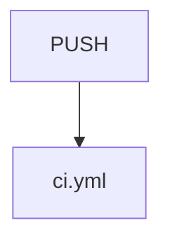

# CI/CD Workflows

## Purpose

The `CI_CD_Workflows` module defines the GitHub Actions automation that keeps
the Atelier monorepo (server, console, CLI, sandbox agent, Helm chart, and
dev base images) correct, versioned, built, and published.

## How this module fits into the system

This module doesn't contain application logic — it orchestrates the
build/test/publish surface of components documented elsewhere.

## Architecture overview

